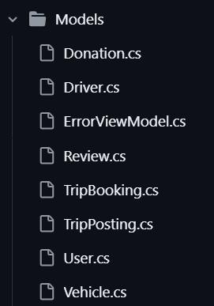

# **📖 PROJECT FLOW CREATION GUIDE 📖** #

<!-- STEP 1 -->
<h2 style="color:red; font-weight: bold; border-bottom: 3px solid #333; padding-bottom: 5px;"> **STEP 1 - INSTALL PACKAGES** </h2>

### **1. Install the Required Packages for ASP.NET MVC Project**
- In **Visual Studio 2022**, go to:
  - **Tools** → **NuGet Package Manager** → **Manage NuGet Packages for Solution...**

❗Make sure that all packages should be the same version or lower version with `Microsoft.EntityFrameworkCore` 

### **2.  Required Packages for Your ASP.NET MVC Project**  

#### **✅ Essential for Database & Entity Framework**  
-  `Microsoft.EntityFrameworkCore` **(v8.0.12)**  (For Entity Framework Core ORM)
-  `Microsoft.EntityFrameworkCore.SqlServer` **(v8.0.12)** (For SQL Server)  
-  `Microsoft.EntityFrameworkCore.Tools` **(v8.0.12)** (For Migrations)  


#### **✅ For ASP.NET Identity (Only if Using Authentication)**  
-  `Microsoft.AspNetCore.Identity.EntityFrameworkCore` **(v8.0.12)** (For User Authentication & Identity Management) 
- `Microsoft.AspNetCore.Identity.UI`**(v8.0.12)** (For Prebuilt Identity UI)


#### **✅ For MVC Views & UI Components**  
-  `Microsoft.AspNetCore.Mvc.Razor.RuntimeCompilation` **(v8.0.00)** (For Razor View Updates Without Restarting)  
-  `Microsoft.AspNetCore.Mvc.NewtonsoftJson` **(v8.0.00)** (For JSON Serialization Support)  


#### **✅ For Paging & Sorting (Required for Your Project)**  
1.  `X.PagedList.Mvc.Core` **(v10.5.7)** (For Pagination & Sorting in Tables)  

#### **✅ Additional Packages for Debugging & Scaffolding** 
1. `Microsoft.AspNetCore.Diagnostics.EntityFrameworkCore`  **(v8.0.00)** (For Better EF Core Error Handling & Debugging)
2. `Microsoft.VisualStudio.Web.CodeGeneration.Design` **(v8.0.00)** (For Scaffolding Controllers, Models, & Views)
_______________________________________

<!-- STEP 2 -->
<h2 style="color:red; font-weight: bold; border-bottom: 3px solid #333; padding-bottom: 5px;"> **STEP 2 - Setup Connection String** </h2>

### 1. Modify `appsettings.json` and `appsettings.Development.json` to Add the Connection String ####

At the top of:
```csharp
{
  "Logging": {
```

add the code below:
```csharp
{

  "ConnectionStrings": {
    "DefaultConnection": "Server=localhost;Database=BCITGODB;User ID=Dannie Password=dannie;Trusted_Connection=True;Encrypt=False"

  },


```

<!-- STEP 3 -->
<h2 style="color:red; font-weight: bold; border-bottom: 3px solid #333; padding-bottom: 5px;"> **STEP 3 - Setup Program.cs** </h2>

### This configures the application's services, like the database connection and dependency injection, ensuring proper interaction with components like Entity Framework.####
1. Check my code for reference
2. Check comments `-added` and add those things to your code.
_______________________________________


<!-- STEP 4 -->
<h2 style="color:red; font-weight: bold; border-bottom: 3px solid #333; padding-bottom: 5px;"> **STEP 4 - Setup ApplicationDbContext** </h2>

### This manages the connection to the database and provides access to the tables (models) in the database for performing operations like adding, updating, or retrieving data. ####


1.  Create `data` folder and create `ApplicationDbContext` class inside.
2. Setup > check my code for reference
_______________________________________


<!-- STEP 5 -->
<h2 style="color:red; font-weight: bold; border-bottom: 3px solid #333; padding-bottom: 5px;"> **STEP 5 - Create DbInitializer** </h2>

### DbInitializer is for seeding data (if you need to add initial records or test data to your tables) ####

1. Under `data` folder, create `DbInitializert` class inside.
2. Setup > check my code for reference
_______________________________________


<!-- STEP 6 -->
<h2 style="color:red; font-weight: bold; border-bottom: 3px solid #333; padding-bottom: 5px;"> **STEP 6 - Define the Model Classes** </h2>

### This represents the structure of your database tables and allows you to interact with the database using Entity Framework Core for data manipulation. ####

1. Under `models` folder, create class for each table. *(see sample below)*
2. Setup and check my code for reference.



_______________________________________

<!-- STEP 7 -->
<h2 style="color:red; font-weight: bold; border-bottom: 3px solid #333; padding-bottom: 5px;"> **STEP 7 -  Migrate and Update Database ** </h2>

### Important steps in Entity Framework Core because they allow your application to: ####


### **1. Migrate:**
- **Create and update database schemas** automatically based on changes made to your models.
- **Generate migration files** that contain the instructions for altering the database schema (adding tables, columns, removing tables, etc.), ensuring that your database schema is always in sync with your models.
  
  In simple terms, **migrate** applies any pending changes to your database schema, whether that means creating a new table, adding columns, or altering existing tables.

### **2. Update-Database:**
- **Apply migrations** to the actual database.
- After you generate a migration with `Add-Migration`, you must use `Update-Database` to **apply the changes** from that migration to the database. This ensures that the database reflects the changes you've made in your application code (models).
- **Create or update the actual database** by executing the migration commands on the connected database (like adding new tables, columns, etc.).

### **STEPS TO DO**
1. Tools > NuGetPackageManager > Package Manager Console
2. On Package Manager Console type `Add-Migration InitialCreate`
    -  You should be able to see `Build succeeded`.
3. On Package Manager Console type `Update-Database`.
    -  You should be able to see `Done`.
4. Check if it is successful
    - **Option 1:** on SQL Server Explorer, refresh `SQL Server`. You should be able to see the new DB under `databases`
    - **Option 2:** on SSMS , refresh `local host`. You should be able to see the new DB under `databases`. Query on SSMS `SELECT TOP 5 * FROM Donation;` to pull out the first few rows.
5. Run the code >> `Run HTTPS` to push the data on the database.

### **DEBUG DB**
1. If you changed any code related to DB to the following:
    - Since you already did the `Add-Migration InitialCreate` and `Update-Database`, just use `Ctrl + Shift + B` to rebuild the solution
    - Run the code >> `Run HTTPS` to push the data on the database.
    - Refresh DB and check if successful.

2. Redoing the Database. Run the following:
    - `dotnet clean`
    - `dotnet build`
    - `dotnet ef migrations add InitialCreate`
    - `dotnet ef database update` 
    - run https code again

_______________________________________

<!-- STEP 8 -->
<h2 style="color:red; font-weight: bold; border-bottom: 3px solid #333; padding-bottom: 5px;"> **STEP 8 -  Scaffold CRUD Pages ** </h2>

1. Right click on the `Controllers` folder, select **Add** → **New Scaffolded Item** → **MVC Controller with views, using Entity Framework**.
    - Model Class - *the model you want to scaffold (e.g., `TripPosting`, `User`, etc.)*
    - DbContextClass - Select the `ApplicationDbContext` that you need.

This will generate the views and controller methods for CRUD operations.
_______________________________________

<!-- STEP 9 -->
<h2 style="color:red; font-weight: bold; border-bottom: 3px solid #333; padding-bottom: 5px;"> **STEP 9 -  Update Title & Navigation Links ** </h2>


